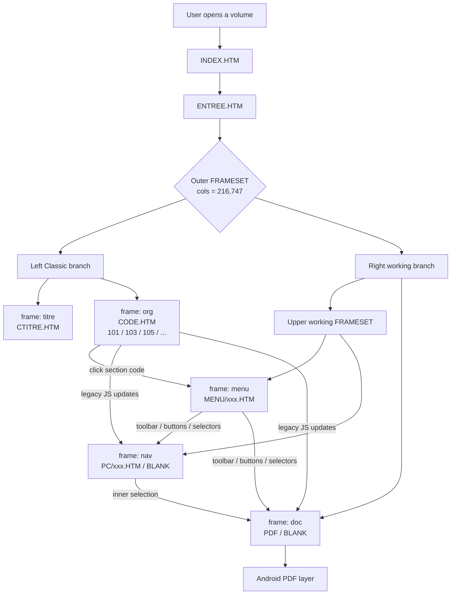
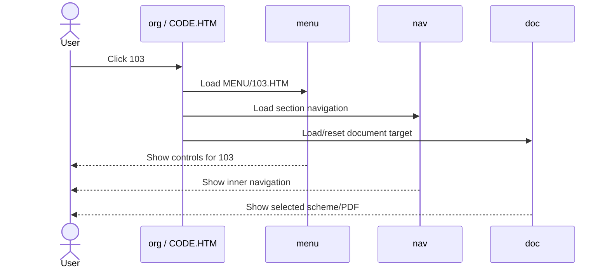

# Renault Docs — Classic architecture

This document describes the **current Classic runtime** for the Renault documentation set, based on the real NT8183A / Laguna II frame-tree captured on the phone.

## High-level flow

## Real frame roles

| Frame | Source example | Responsibility |
|---|---|---|
| `titre` | `RUS/HTM/CTITRE.HTM` | Classic title/header block |
| `org` | `RUS/HTM/CODE.HTM` | Main section navigation: `101`, `103`, `105`, ... |
| `menu` | `RUS/HTM/MENU/101.HTM` | Section-specific toolbar / commands |
| `nav` | `COMMUN/HTM/PC/101.HTM` or `BLANK.HTM` | Section-specific inner navigation |
| `doc` | PDF or `BLANK.HTM` | Final document / scheme / PDF content |

## Section surfing

Example: moving from section `101` to `103`.

## Important architectural property

Classic is not a collection of independent pages. It is a **cooperating frameset runtime**.

The `org`, `menu`, `nav`, and `doc` frames communicate through legacy JavaScript and frame names. Therefore opening `MENU/101.HTM` by itself does not necessarily recreate the full behavior of Classic.

## Current NT8183A evidence

For the tested volume:

- the top runtime settles on `RUS/HTM/ENTREE.HTM`;
- the outer frameset originally reports `cols = 216,747`;
- `org` exposes about 214 section codes;
- selecting a section changes the named working frames rather than replacing the top page.
