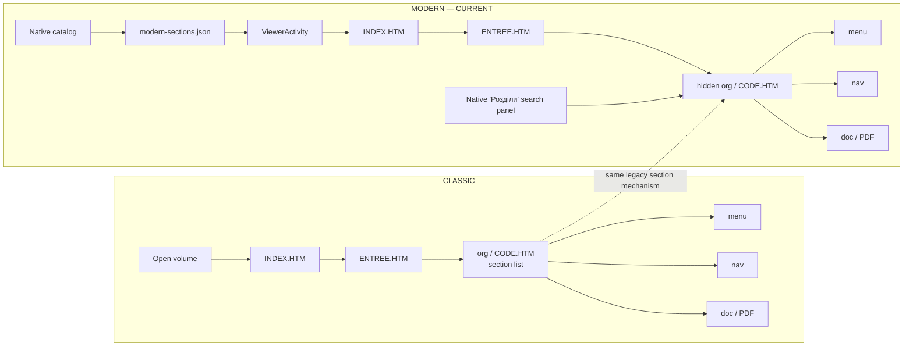
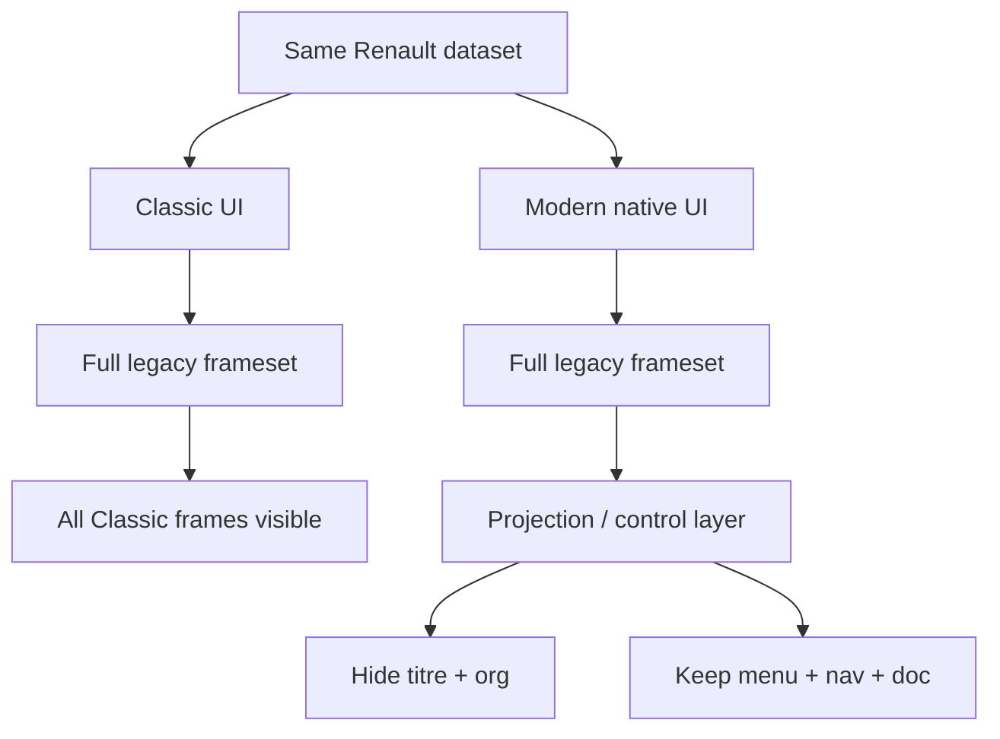
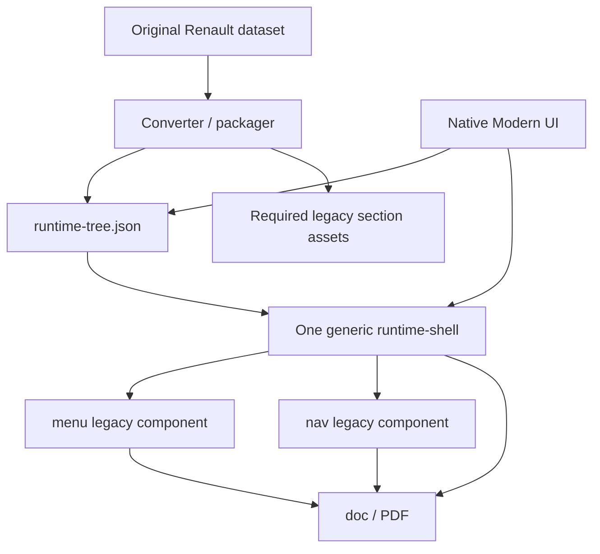
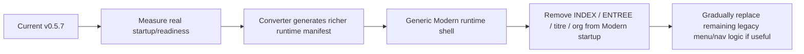

# Renault Docs — Classic vs Modern architecture

This document compares the current Classic runtime with the current Modern implementation.

## Side-by-side architecture



## Functional comparison

| Area | Classic | Modern now |
|---|---|---|
| Volume entry | Legacy HTML | Native Android |
| Section list | `org / CODE.HTM` | `modern-sections.json` |
| User section navigation | Visible Classic left panel | Native `Розділи` panel |
| Runtime section switch | Click in `org` | Android triggers hidden `org` |
| Main runtime | Full Classic frameset | Still full Classic frameset |
| `titre` | Visible | Loaded but projected to width 0 |
| `org` | Visible | Loaded but projected to width 0 |
| `menu` | Visible | Visible |
| `nav` | Visible | Visible |
| `doc` | Visible | Visible |
| PDF | Legacy target + Android PDF handling | Same |
| Top-level reload for live section switch | No | No in v0.5.7 |
| Dependency on legacy frame JS | High | Still high |

## What is actually different today



The current Modern branch changes **presentation and navigation**, but does not yet replace the legacy runtime core.

## Proposed target architecture

The cleaner long-term direction is to move structural knowledge into conversion output.



The target is to stop launching these layers for Modern:

```text
INDEX.HTM
ENTREE.HTM
CTITRE.HTM
CODE.HTM
Classic left frameset
```

Their useful information would instead be normalized during conversion into one manifest, for example:

```json
{
  "volumes": [
    {
      "id": "NT8183A",
      "runtime": {
        "menuFrame": "menu",
        "navFrame": "nav",
        "docFrame": "doc"
      },
      "sections": [
        {
          "code": "101",
          "title": "ПРИКУРИВАТЕЛЬ",
          "menu": "RUS/HTM/MENU/101.HTM",
          "nav": "COMMUN/HTM/PC/101.HTM"
        }
      ]
    }
  ]
}
```

## Migration strategy



This keeps the proven Classic implementation intact while Modern is migrated component by component instead of attempting one large rewrite.
