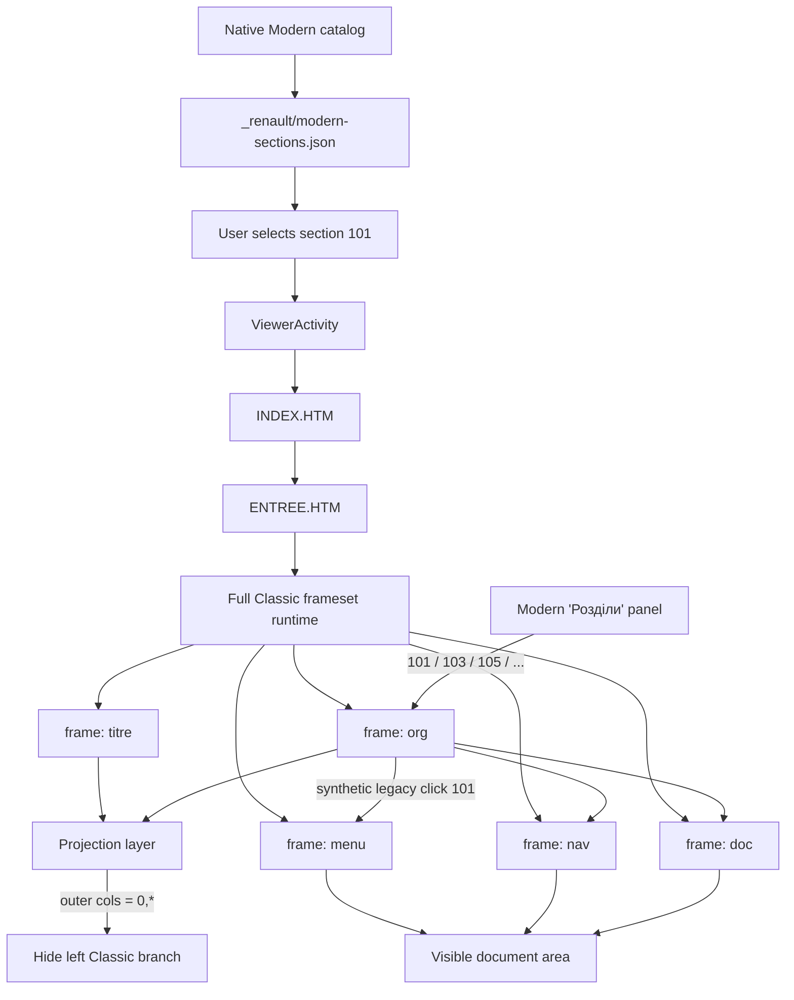
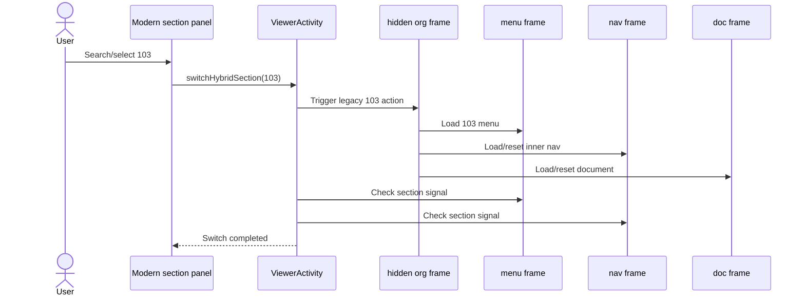

# Renault Docs — Modern architecture (current implementation)

This document describes the **current Modern implementation** as of v0.5.7.

Important: Modern currently provides a native Android catalog and navigation layer, but the document viewer still launches and controls the full legacy Classic frameset runtime underneath.

## High-level flow

## What v0.5.6 solved

The real phone frame-tree showed that `titre + org` form the left Classic branch.

Modern therefore no longer tries to guess frames heuristically. It:

1. waits for the real legacy runtime;
2. finds named frames `titre`, `org`, `menu`, `nav`, `doc`;
3. selects the requested section through `org`;
4. collapses the complete left branch by changing the outer frameset geometry from approximately `216,747` to `0,*`;
5. preserves `menu`, `nav`, and `doc`.

## What v0.5.7 added

The viewer can now switch sections without creating a new top-level ViewerActivity.

## Current architectural limitation

Modern is still effectively:

> Native Android UI → full Classic runtime → hide part of Classic.

So the following legacy layers are still started:

- `INDEX.HTM`;
- `ENTREE.HTM`;
- `CTITRE.HTM`;
- `CODE.HTM`;
- full frameset structure;
- section-specific `MENU/...`;
- section-specific `PC/...`;
- document/PDF frame.

The native UI hides or controls the Classic navigation, but it does not yet replace the Classic runtime architecture.

## Timing evidence from phone

A captured v0.5.7 state showed roughly:

- Fast Pack preparation: `261 ms`;
- top document DOM ready: `298 ms`;
- top document load event: `414 ms`;
- deterministic projection: about `3 ms`;
- live section switch: about `101 ms`.

This strongly suggests that frame hiding/projection is not the main performance problem.

A remaining issue is readiness: after a live switch, `menu` may already expose the requested section while `nav` and `doc` are still `BLANK.HTM`. The current completion condition should therefore eventually be strengthened to represent the real working state, not merely the first section signal.
