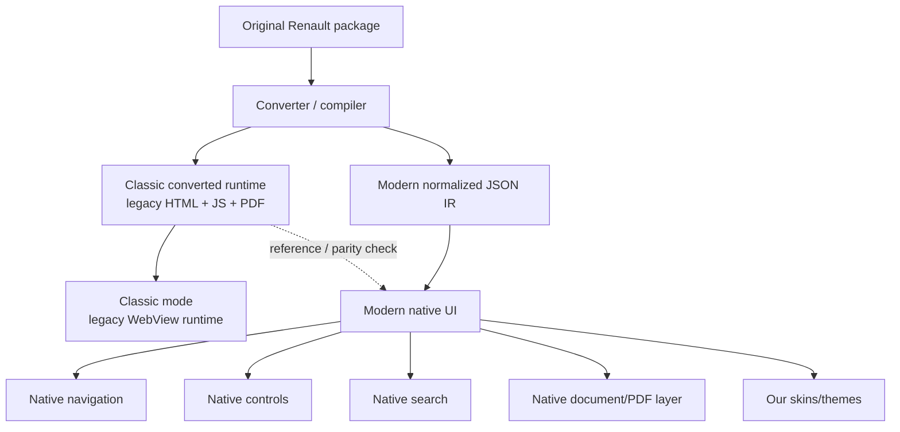

# Modern Native IR — канонічне архітектурне рішення

Дата: 2026-09-24

Статус: **прийнято / реалізація розпочата**

## Рішення

Classic і Modern надалі є **двома різними режимами одного dataset**.

### Classic

Classic не переписуємо і не ламаємо.

Після конвертації зберігається робоча legacy-модель Renault:

- `INDEX.HTM`;
- `ENTREE.HTM`;
- `CTITRE.HTM`;
- `CODE.HTM`;
- `MENU/*.HTM`;
- `PC/*.HTM`;
- legacy JavaScript;
- PDF/GIF/інші assets.

Classic залишається:

1. compatibility mode;
2. reference implementation;
3. oracle для перевірки Modern;
4. fallback, якщо якийсь старий тип документації ще не скомпільований у native-модель.

### Modern

Modern **не повинен у фінальній архітектурі запускати Classic і потім ховати його UI**.

Під час конвертації/пакування ми один раз аналізуємо Classic HTML/JS і компілюємо потрібні дані в наш нормалізований JSON IR.

Після цього Android Modern працює з нашим JSON-контрактом та власним UI.

Конвертація може бути довшою. Runtime на телефоні має бути максимально простим і швидким.

## Головний принцип

```text
повільніше один раз при конвертації
                 ↓
       готова нормалізована модель
                 ↓
      швидкий native runtime завжди
```

## Архітектура



## Що робить converter/compiler

Converter більше не розглядається лише як виправлення шляхів.

Це компілятор старої Renault-документації у дві форми:

```text
Original Renault
      │
      ├──────────────► Classic-compatible dataset
      │
      └──────────────► Modern normalized IR
```

Він повинен поступово навчитися витягувати:

### Phase 1 — shell + navigation

- структуру `INDEX.HTM`;
- переходи до `ENTREE.HTM`;
- FRAMESET topology;
- named frames `titre/org/menu/nav/doc`;
- список секцій 101/103/105/...;
- назви секцій;
- legacy entrypoint кожної секції.

### Phase 2 — controls

З `MENU/xxx.HTM` і `PC/xxx.HTM`:

- buttons;
- selectors;
- options;
- tabs;
- inner navigation;
- labels;
- default values;
- залежності між controls.

### Phase 3 — actions

Legacy JavaScript компілюється у declarative actions, наприклад:

```javascript
parent.frames["doc"].location =
    "../../COMMUN/PDF/PC/S7.pdf";
```

має перетворюватися приблизно на:

```json
{
  "type": "open_document",
  "target": "COMMUN/PDF/PC/S7.pdf"
}
```

### Phase 4 — document graph

Компілятор збирає:

- PDF;
- images/GIF;
- HTML documents;
- relation control → action → document;
- variants/conditions;
- cross-links.

### Phase 5 — fully native Modern

Modern більше не потребує:

- `INDEX.HTM`;
- `ENTREE.HTM`;
- `CTITRE.HTM`;
- `CODE.HTM`;
- hidden `org`;
- projection `cols=0,*`;
- synthetic clicks;
- очікування legacy frame lifecycle.

## JSON контракт

Перший файл:

```text
_renault/runtime-tree.json
```

На першій фазі це один dataset-level JSON з масивом volumes.

Приклад:

```json
{
  "schema_version": 1,
  "format": "renault-runtime-ir",
  "classic_preserved": true,
  "modern_data_contract": "normalized-json",
  "volumes": [
    {
      "id": "laguna-x74-nt8183a-2001-01-22",
      "classic": {
        "entrypoint": "Laguna X74 NT8183A 2001_01_22/INDEX.HTM",
        "pages": [],
        "named_frames": {}
      },
      "modern": {
        "sections": [
          {
            "code": "101",
            "title": "ПРИКУРИВАТЕЛЬ",
            "legacy_entrypoint": "Laguna X74 NT8183A 2001_01_22/RUS/HTM/MENU/101.HTM",
            "controls": [],
            "actions": [],
            "documents": [],
            "compile_state": "navigation-indexed"
          }
        ]
      }
    }
  ]
}
```

Порожні `controls/actions/documents` на Phase 1 є навмисними. Вони заповнюватимуться наступними фазами compiler-а.

## Чому не переписуємо оригінальні HTML

Modern IR є **додатковим артефактом**, а не мутацією джерела.

Це дає:

- можливість завжди відкрити Classic;
- можливість порівняти Modern з оригінальною поведінкою;
- повторну компіляцію при покращенні parser-а;
- безпечне відновлення після помилки compiler-а;
- підтримку різних поколінь Renault документації.

## Skin/UI

Після переходу на IR дані та UI повністю розділяються.

Один і той самий документ може мати будь-який Modern skin:

- Technical Blue;
- AMOLED;
- light;
- tablet/desktop;
- accessibility mode;
- майбутні custom skins.

Skin більше не залежить від кольорів, таблиць або FRAMESET старого Renault HTML.

## Поточна реалізація

Phase 1 розпочата в `core/runtime_ir.py`.

Під час package/conversion генерується:

```text
_renault/runtime-tree.json
```

Поточний compiler уже збирає:

- Classic shell/frame topology;
- named frame targets;
- native section catalog;
- legacy entrypoint секції;
- compiler state/pending stages.

Dataset manifest отримує:

```json
{
  "runtime_tree": "_renault/runtime-tree.json"
}
```

## Критерій переходу Modern на новий runtime

Не відключати current hybrid Modern одразу.

Спочатку один реальний блок, починаючи з **101**, має бути повністю відтворений з IR:

1. секція;
2. controls;
3. combo/variants;
4. actions;
5. documents/PDF;
6. navigation;
7. результат відповідає Classic.

Після parity для 101 масштабувати compiler на інші секції.

Classic весь цей час залишається недоторканим.


## Multi-year menu compatibility rule

Do not model the Modern renderer around the NT8183A/2001 toolbar as a fixed button set.

Later Renault volumes/years may expose different menu items and different legacy handlers.

Required contract:
- compiler discovers menu items from source HTML;
- Runtime IR stores arbitrary action-bar items;
- Android renders action-bar items from JSON rather than hard-coded labels;
- normalized actions execute natively;
- unrecognized/dynamic legacy JavaScript remains explicit as `legacy-javascript` and routes to Classic fallback;
- coverage is measured across all volumes/years before claiming full native support.

Generated audit:
`_renault/runtime-ir-coverage.json`.

The audit is the migration checklist for later menu generations.

## Current Runtime IR v2 state

Runtime tree schema is now v2 / `section-ir-v2`.

Per-section data may contain:
- `panels[]`;
- `controls[]`;
- `actions[]`;
- `documents[]`;
- `assets[]`;
- `source_files[]`.

Android v0.5.8 introduces the first generic native renderer.

Its menu/control/document UI is data-driven. It does not hard-code SCH/NM/PC/GENE as the only valid menu.

## Dataset-family compatibility gate

The real Laguna II coverage audit validated 10 volumes / 2174 sections with zero unsupported actions and zero warnings.

For future Renault datasets, including a possible Laguna III source, do not infer compatibility from model name alone.

Each new dataset family must pass:
- Classic preservation;
- shell/topology discovery;
- Runtime IR compilation;
- cross-volume coverage audit;
- unsupported-action/warning review;
- native renderer parity sampling.

Only after that should native Modern be considered supported for that dataset family.

