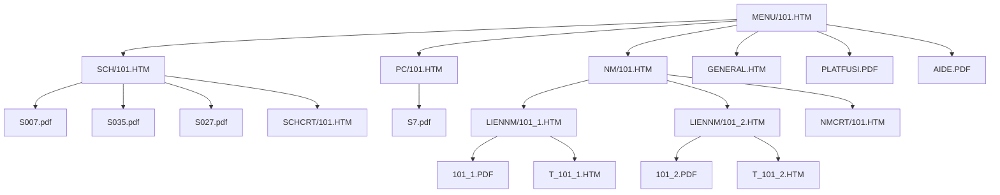

# Runtime IR Phase 2 — NT8183A / 101 real source finding

Date: 2026-09-24

Source:
`Runtime-IR-NT8183A-101-source.zip` generated on the real phone dataset.

Status: **evidence complete / compiler v2 implemented**

## Bundle summary

Focused source graph for:

- volume: `NT8183A`;
- section: `101`;
- title: `ПРИКУРИВАТЕЛЬ`.

Bundle contains:

- 14 text source files;
- 30 referenced binary assets/documents;
- 61 dependency edges;
- no missing references;
- dependency scan was not truncated.

This is enough to describe section 101 without executing the full Classic frameset.

## Real 101 navigation graph



## MENU/101 semantics

The menu is not complicated application logic. It is a static action bar.

Real actions:

1. `SCH` → open schematic selector in `nav`;
2. `NM` → open nomenclature selector in `nav`;
3. `PC` → open PC document list in `nav`;
4. one blank/disabled button slot;
5. `GENE` → open general-document selector in `nav`;
6. `PLATFUSI` → open fuse/platform PDF in `doc`;
7. `AIDE` → open help PDF in `doc`.

MENU onLoad clears both `nav` and `doc`.

The two direct PDF buttons additionally clear `nav`.

This behavior maps cleanly to native declarative actions and does not require WebView JavaScript.

## SCH/101 semantics

`SCH/101.HTM` contains one selector:

`listeCritere`

Legacy handler:

`afficherSchema(this, parent.doc)`

The only real behavior of `afficherSchema` in `VISU.JS` is:

1. read the selected option value;
2. remove any `#...` fragment;
3. navigate the document frame to that path.

The selector contains group/prompt rows plus three real schematic routes:

- `S007.pdf`;
- `S035.pdf`;
- `S027.pdf`.

The source option values also contain old `#zoom=...` fragments. Runtime JS strips them before navigation. The Modern IR keeps the fragment as legacy metadata but the document identity is the PDF path.

`SCHCRT/101.HTM` is a printable structured HTML criteria/abbreviation page.

## NM/101 semantics

`NM/101.HTM` also contains one selector:

`listeCritere`

Legacy handler:

`afficherNomenclature(this, parent.doc)`

The handler simply navigates `doc` to the selected value.

Two real variants exist:

### Variant 101_2

Criteria:
`DD`

Route:
`NM/LIENNM/101_2.HTM`

That HTML is only a two-row frameset:

- `dessin` → `COMMUN/PDF/NM/101_2.PDF`;
- `alveoles` → `T_101_2.HTM`.

### Variant 101_1

Criteria:
`DG/E2/SSNAV/SRUNLI`,
`DG/E2/NINAV3/SRUNLI`,
`DG/E2,E3/NINAV3/SRUNLI`.

Route:
`NM/LIENNM/101_1.HTM`

Again it is only a two-row frameset:

- `dessin` → `COMMUN/PDF/NM/101_1.PDF`;
- `alveoles` → `T_101_1.HTM`.

Therefore the old nested frameset can be compiled into one native composite document:

```text
NomenclatureDocument
├── drawing PDF
└── structured details table
```

No legacy frames are inherently required for this representation.

## Nomenclature detail data

Both `T_101_1.HTM` and `T_101_2.HTM` expose ordinary structured tables.

For 101 the connector rows are:

- pin 1 · section 0.35 · code LPG · source description;
- pin 2 · section 1.0 · code SP7 · source description;
- pin 3 · section 1.0 · code M · mass/ground description.

The surrounding header includes:

- section code;
- section title;
- selected vehicle criteria;
- harness/body family metadata.

This can be represented directly in JSON and rendered natively.

## PC/101 semantics

`COMMUN/HTM/PC/101.HTM` is a single document card:

- thumbnail: `VS7.gif`;
- document: `COMMUN/PDF/PC/S7.pdf`.

Its onLoad only clears `doc`.

Again there is no required dynamic runtime logic.

## GENERAL semantics

`GENERAL.HTM` is another ordinary select-to-document mapping.

Options include:

- subject index;
- abbreviations;
- electrical equipment list;
- connections list;
- ground connections list;
- electrical circuits list;
- general information.

All targets are PDFs.

This page is shared volume-level data and can later be de-duplicated instead of copied into every section IR.

## Real legacy JavaScript dependency

The whole focused bundle references one shared script:

`COMMUN/JS/VISU.JS`

For this section it defines only four tiny functions:

- `afficherNomenclature` → navigate selected value;
- `afficherSchema` → navigate selected value after stripping URL fragment;
- `imprimer` → `window.print()`;
- `retourArriere` → `history.back()`.

For 101, none of these require a JavaScript runtime once converted into native actions.

This is the strongest evidence so far that a fully native Modern renderer is viable.

## Runtime IR v2 mapping

The Phase 2 compiler now normalizes the above into:

```text
section
├── panels[]
│   ├── menu
│   ├── schematic
│   ├── nomenclature
│   ├── pc
│   └── general
├── controls[]
│   ├── action-bar
│   ├── select
│   └── document-list
├── actions[]
│   ├── open-panel
│   ├── open-document
│   ├── set-surface-location
│   └── print / legacy fallback
├── documents[]
│   ├── pdf
│   ├── composite-document
│   └── structured-html
├── assets[]
└── source_files[]
```

Schema version moves to `2`.

Compiler phase:
`section-ir-v2`.

## Important migration rule

Classic stays unchanged.

Modern v2 data is additive. If an unknown/dynamic legacy pattern appears, the compiler must report/fallback rather than deleting or mutating the Classic source.

## Next gate

Regenerate `runtime-tree.json` on the real dataset with Runtime IR v2 and inspect the emitted NT8183A / 101 section.

After the generated JSON matches this source finding, the next implementation target is a native Android proof-of-concept renderer for 101 that reads only Runtime IR v2 data for navigation/controls.
