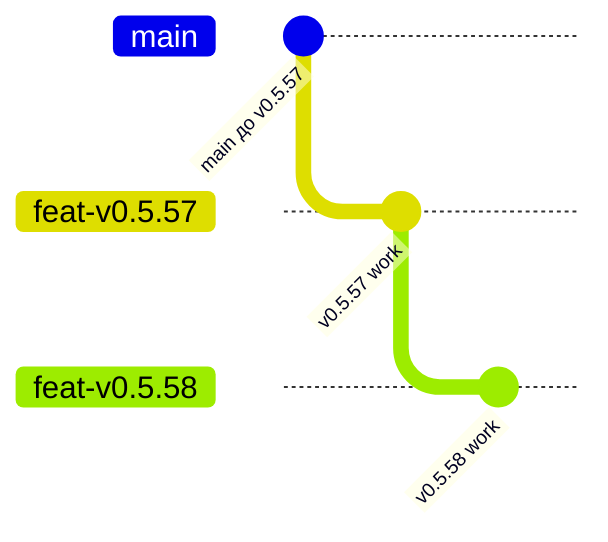

# Git branches, Pull Requests and Merge — Renault Docs

Цей файл зберігає просте пояснення Git-процесу, який був використаний під час закриття v0.5.57 і v0.5.58.

## Коротко

- **Branch / гілка** — окрема лінія розробки. У ній робляться зміни, не ламаючи `main`.
- **Pull Request / PR** — запит об'єднати зміни з однієї гілки в іншу.
- **CI / Checks** — автоматичні перевірки перед merge. Для Renault Docs ключові: `Tests` і `Android PR Check`.
- **Merge** — фактичне включення змін із feature-гілки в цільову гілку.
- **main** — головна актуальна лінія коду.

## Реальний приклад v0.5.57 → v0.5.58

Спочатку v0.5.58 була створена поверх незмердженої v0.5.57:



PR-и були такими:

- **PR #16**: `feat/v0.5.57-durable-export-share` → `main`
- **PR #17**: `feat/v0.5.58-volume-identity` → спочатку `feat/v0.5.57-durable-export-share`

Це називається stacked PR: наступна робота побудована поверх попередньої гілки.

## Що зробили

### 1. Merge PR #16

Після PASS перевірок v0.5.57 була merged у `main`.

```text
feat/v0.5.57  ── PR #16 ── MERGE ──► main
```

Після цього `main` уже містив усю v0.5.57.

### 2. Змінили base PR #17 на main

Оскільки v0.5.57 уже була у `main`, PR #17 більше не мав базуватися на старій feature-гілці.

Було:

```text
base: feat/v0.5.57-durable-export-share
head: feat/v0.5.58-volume-identity
```

Стало:

```text
base: main
head: feat/v0.5.58-volume-identity
```

Після зміни base GitHub повторно перевіряє різницю між актуальним `main` і v0.5.58.

### 3. CI

Перед merge PR #17 обов'язково мають бути зеленими:

```text
Tests             PASS
Android PR Check  PASS
```

### 4. Merge PR #17

Після PASS v0.5.58 була merged у `main`.

Фінальна логіка:

```text
main
├── попередні версії
├── v0.5.57   ← PR #16 merged
└── v0.5.58   ← PR #17 merged
```

Тобто після merge обох PR саме `main` містить усі прийняті зміни.

## Як думати про це простіше

Уявляй `main` як офіційну книгу.

- branch — окремий чернетковий зошит;
- PR — прохання перенести готові сторінки із зошита в офіційну книгу;
- CI — перевірка, що сторінки не зіпсовані;
- merge — момент, коли сторінки реально потрапляють у книгу.

Після merge feature-гілка вже не є джерелом актуальної версії. Актуальна версія знаходиться в `main`.

## Renault Docs release rule

Для послідовних залежних релізів:

1. завершити та перевірити нижню feature-гілку;
2. merge її PR у `main`;
3. для наступного stacked PR змінити `base` на `main`;
4. дочекатися PASS усіх required checks;
5. merge наступний PR;
6. повернути локальний Termux repository на `main`;
7. зібрати фінальний signed APK саме з актуального `main`.

Не merge верхній stacked PR раніше нижнього, якщо верхня гілка залежить від нижньої.
