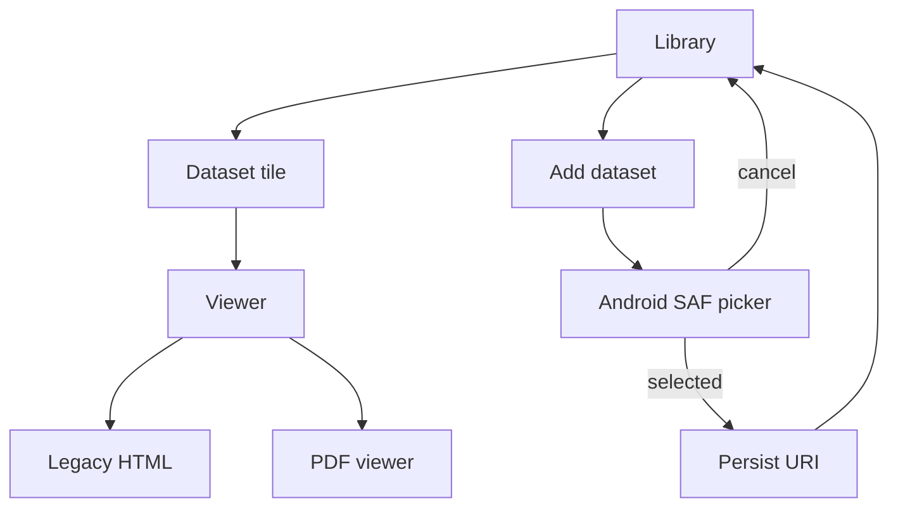
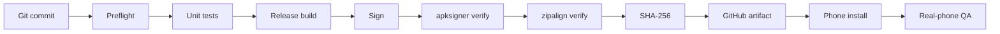

# Правила майбутнього Renault Android-застосунку

Ці правила перенесені з досвіду YTM Importer, де проблеми вже реально проявлялися на телефоні.

## Що беремо з YTM

Ми не копіюємо YTM UI або business logic.

Беремо перевірені **системні правила**:

- rotation не запускає дію вдруге;
- dialogs/help/result відновлюються над правильним parent;
- Back/Cancel мають явного owner;
- long operation живе окремо від Activity;
- completed status не зникає лише через закриття result modal;
- SAF picker має правильне повернення після Cancel;
- destructive actions завжди підтверджуються;
- adaptive button layouts;
- 48dp touch targets для критичних controls;
- safe insets;
- stable dialog first frame без стрибка;
- real-phone QA окремо від static/unit/build PASS;
- signed APK + SHA-256 + apksigner + zipalign;
- release docs створюються до feature changes.

## Як це застосовується до Renault



## Вікна

App-owned Help / confirmation / result dialogs мають один shared UI pipeline.

Базове правило появи:

```text
configure Window
    ↓
hide until geometry/insets stable
    ↓
show + normalize
    ↓
reveal
```

Це захищає від проблеми, яку вже ловили в YTM: dialog спочатку видно в одному місці/розмірі, а після першого layout він «стрибає».

## Rotation

Наприклад PDF уже відкритий:

```text
PDF page 3 / zoom 140%
        ↓ rotate
Activity recreation
        ↓
PDF page 3 / zoom 140%
```

Ніякого другого import/open/download.

## Library tile

Плитка показує:
- Renault model;
- years;
- platform;
- type;
- availability.

Tap → open.

`⋮` → actions.

Long press → те саме menu.

Remove dataset → confirmation.

## Dataset access

Фінальний app зберігає Android **persistable SAF URI**, а не залежить від hardcoded `/storage/emulated/0/...`.

Для Renault v1 не додаємо broad `MANAGE_EXTERNAL_STORAGE`: він нам не потрібен для нормальної library/reference-mode архітектури.

## PDF

PDF handler один для всіх Renault datasets.

Це дозволяє однаково працювати Laguna/Megane/Scenic/Espace тощо без PDF-specific code у кожному dataset.

## Орієнтація

Не блокуємо landscape, щоб приховати layout defect.

Portrait і landscape входять у regression/phone QA.

## APK

Майбутній release pipeline:



Поки Android module ще не створений, build workflow не додаємо як активний, щоб CI не був навмисно червоним.

Повна схема екранів: `docs/ua/ANDROID_BLUEPRINT.md`.
