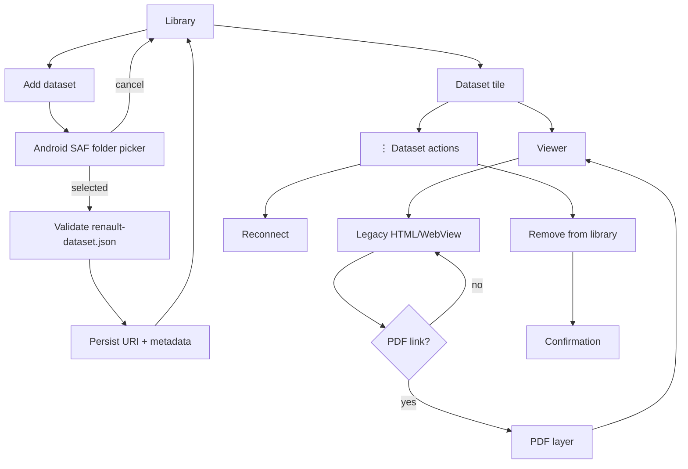

# Android Blueprint — Renault Docs

Це початкова структура APK, яку будемо реалізовувати після стабілізації browser/PDF layer.

## Екрани v1

## Library

Головний screen.

Плитка dataset:
- title/model;
- years;
- platform;
- content type;
- preview;
- available/unavailable state;
- optional last-opened information.

Tap → Viewer.

`⋮` → complete action menu.

Long press → те саме menu, але ніякого direct delete.

## Add dataset

App-owned screen/flow перед system picker може коротко пояснювати, що потрібно вибрати **корінь конвертованого dataset**.

Після SAF selection:
1. persist permission;
2. знайти `renault-dataset.json`;
3. validate schema;
4. validate entrypoint exists;
5. зберегти URI + manifest metadata;
6. створити tile.

Invalid dataset → зрозуміла помилка, без створення broken tile.

## Viewer

Один універсальний viewer для всіх моделей.

State:
- dataset id;
- current relative URL;
- history/back stack;
- scroll/semantic state where practical;
- PDF state separately.

Android navigation належить app, не старому HTML.

## PDF layer

PDF не віддавати випадковій поведінці Chrome/WebView.

Viewer intercept:
- `.pdf` / `.PDF`;
- query/fragment;
- старий `#viewrect`.

PDF screen/state:
- document URI/path within dataset;
- page;
- zoom;
- position;
- loading/error.

Rotation відновлює state, а не відкриває PDF вдруге як нову action.

## Dataset actions

Початково:
- Open;
- Reconnect folder;
- Dataset info;
- Remove from library.

Remove **не видаляє Renault data з диска**. Воно лише прибирає реєстрацію з Library, якщо окрема destructive file-delete функція не буде колись явно додана.

## Settings

Початково мінімум:
- theme (коли theme system буде реалізовано);
- viewer behavior/debug info;
- About;
- diagnostic/version information.

Не перевантажувати v1 налаштуваннями, які не мають реального use case.

## Help

Help — app modal/screen state.
Rotation має відновлювати його над тим самим parent.
Close повертає туди ж.

## Орієнтація

`screenOrientation="unspecified"`.

Не блокувати landscape лише щоб приховати layout bug.

Portrait і landscape входять у phone QA.

## IME

Екрани з editable fields використовують layout, де keyboard не перекриває required actions.
За потреби `adjustResize`, але це перевіряється на реальному screen, а не глобально копіюється.

## Компоненти, які мають бути shared

- Theme/palette manager;
- app bar / Back control;
- Tile component;
- Dialog/modal engine;
- adaptive action row;
- safe-insets helper;
- dataset manifest validator;
- SAF access layer;
- viewer navigation state;
- PDF state/handler;
- operation state owner для довгих tasks.

## Що НЕ копіюємо з YTM

- OAuth;
- YouTube API;
- playlist logic;
- YTM package id;
- YTM colors/branding;
- `MANAGE_EXTERNAL_STORAGE` тільки тому, що він є у поточному YTM manifest;
- release version numbers;
- YTM-specific Activities.

## Реалізаційний статус

### v0.1.0 — Android Library skeleton

Вже закладено в `android/`:
- MainActivity Library;
- SAF `ACTION_OPEN_DOCUMENT_TREE`;
- persistable read permission;
- parser/validator `renault-dataset.json`;
- persistent dataset registration;
- Laguna tile;
- Viewer placeholder;
- JVM unit tests;
- debug APK CI artifact.

### v0.2.0 — Converter foundation

Розроблено:
- `Конвертувати стару папку` як окремий Android flow;
- source SAF tree;
- destination SAF tree з write permission;
- persistable URI;
- draft state, який переживає Activity recreation без автозапуску picker;
- same-source/destination guard;
- output-folder naming plan;
- Kotlin path-case normalizer з unit tests, що повторюють ключові Python converter cases.

v0.2.0 навмисно ще не запускає копіювання 60k+ файлів. Phone QA цього SAF/lifecycle foundation має передувати підключенню long-running writer.

### Наступна хвиля

1. foreground long-running conversion owner;
2. staged output + cancel/failure cleanup;
3. Kotlin dataset manifest/package generator;
4. progress/completed/result lifecycle;
5. add converted output to Library;
6. universal WebView;
7. Android PDF layer.
