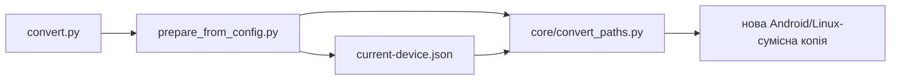

# Конвертер

## Де він знаходиться

Є два рівні:

- `convert.py` — простий запуск із кореня репозиторію;
- `core/convert_paths.py` — справжня логіка конвертації.

Для звичайного використання тобі потрібен саме:

```text
convert.py
```

## Що він робить

За замовчуванням читає:

```text
config/current-device.json
```

Звідти бере:

```text
/storage/emulated/0/Documents/Renault/laguna 2 2001-2006
```

і створює нову виправлену копію:

```text
/storage/emulated/0/Documents/Renault/laguna 2 2001-2006_android
```

Оригінальну папку не змінює.

## Запуск

У корені репозиторію:

```bash
python convert.py
```

## Схема



## Важливо

Це поки не Android-застосунок і не APK. Це робочий конвертер для етапу розробки.

Пізніше ця сама логіка буде викликатися з нашого Android-застосунку через нормальний інтерфейс.


## Modern Runtime IR

Конвертер/packager тепер поступово стає compiler-ом старої Renault документації.

Classic-копія **не видаляється і не переписується як runtime**. Вона залишається робочим compatibility/reference mode.

Паралельно package step генерує:

```text
_renault/runtime-tree.json
```

Це нормалізований JSON-контракт для майбутнього повністю native Modern mode.

Phase 1 містить:
- Classic shell/frame topology;
- named frames;
- список секцій 101/103/105/...;
- назви секцій;
- legacy entrypoint кожної секції;
- явний compiler state для ще не розібраних controls/actions/documents.

Наступні фази будуть компілювати `MENU/*.HTM`, `PC/*.HTM` та legacy JavaScript у наші declarative controls/actions/document routes.

Архітектурний контракт:
`docs/architecture/MODERN_NATIVE_IR_PLAN.md`.
