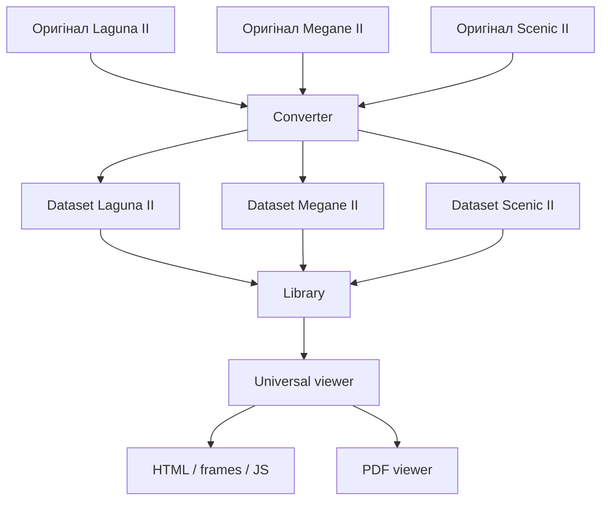

# Бібліотека наборів Renault

## Ідея

Застосунок не повинен знати про Laguna II у коді.

Він повинен знати лише стандарт **Renault dataset**: папку з уже нормалізованими даними та файлом `renault-dataset.json`.

Тому можна підготувати Laguna II, Megane II, Scenic, Espace або окремий том електросхем — і всі вони відкриватимуться одним viewer.



## Формат dataset

У корені кожної конвертованої папки буде:

```text
renault-dataset.json
INDEX.HTM
...
```

Приклад:

```json
{
  "schema_version": 1,
  "id": "renault-laguna-ii-x74-2001-2006",
  "title": "Renault Laguna II 2001–2006",
  "manufacturer": "Renault",
  "model": "Laguna II",
  "platform": "X74",
  "years": {
    "from": 2001,
    "to": 2006
  },
  "entrypoint": "INDEX.HTM",
  "viewer_profile": "renault-legacy-web-v1"
}
```

Тобто viewer не вгадує, що це за машина. Він читає manifest.

## Як це виглядатиме у застосунку

Користувач натискає **Додати документацію** і вибирає папку.

Android-застосунок:

1. отримує доступ до папки через Storage Access Framework;
2. знаходить `renault-dataset.json`;
3. перевіряє його;
4. зберігає постійний URI-доступ до папки;
5. зберігає metadata у локальній library database;
6. створює плитку.

Приклад бібліотеки:

```text
┌──────────────────────┐  ┌──────────────────────┐
│      Laguna II       │  │      Megane II       │
│      2001–2006       │  │      2002–2009       │
│         X74          │  │         X84          │
└──────────────────────┘  └──────────────────────┘
```

Натискання на плитку відкриває `entrypoint` саме цього dataset.

## Важливо: не абсолютний Android-шлях

У Termux ми зараз можемо користуватись:

```text
/storage/emulated/0/Documents/...
```

Але фінальний Android app повинен зберігати не сирий filesystem path, а **persistable content URI**, який Android видає через Storage Access Framework.

Так доступ переживає перезапуск застосунку і відповідає сучасній моделі Android storage permissions.

## Reference mode і Managed mode

Плануємо два режими.

### Reference mode

Дані залишаються там, де їх поклав користувач.

Застосунок зберігає лише URI + metadata.

Перевага: немає другої копії сотень мегабайт.

### Managed mode

Застосунок імпортує dataset у своє контрольоване сховище.

Перевага: папку не можна випадково перемістити або видалити.

Для першої версії пріоритет — Reference mode.

## Preview плитки

Manifest підтримує блок `preview`.

Спочатку плитка може бути згенерована з:

- моделі;
- років;
- platform code.

Пізніше dataset зможе містити власне зображення, наприклад:

```text
.preview/cover.webp
```

Viewer не залежатиме від цього зображення.

## PDF

PDF viewer є функцією оболонки, а не конкретного dataset.

Тому одна реалізація PDF viewer працюватиме для Laguna, Megane, Scenic та інших пакетів.

Старі `#viewrect=...` також оброблятимуться viewer-адаптером централізовано.

## Поточна Laguna II

Для вже створеної папки:

```text
/storage/emulated/0/Documents/Renault/laguna 2 2001-2006_android
```

manifest можна додати без повторної конвертації:

```bash
reno-code
git pull
python tools/create_dataset_manifest.py
```

Після цього перевірити бібліотечний scanner:

```bash
python tools/list_library.py "/storage/emulated/0/Documents/Renault"
```


## Один dataset може містити багато внутрішніх томів

Для Renault це важливо: один пакет автомобіля часто містить кілька редакцій/NT/Visu.

У manifest вони лежать у `volumes`.

Глобальна Android Library показує одну плитку автомобіля, а вже всередині dataset відкривається каталог його томів.

Для поточної Laguna II автопошук працює по top-level папках, у яких є власний `INDEX.HTM/INDEX.HTML/ACCUEIL.HTM`.

Після оновлення package:

```bash
python tools/package_dataset.py
```

створюється `_renault/START.html` з плитками кожної знайденої редакції.
