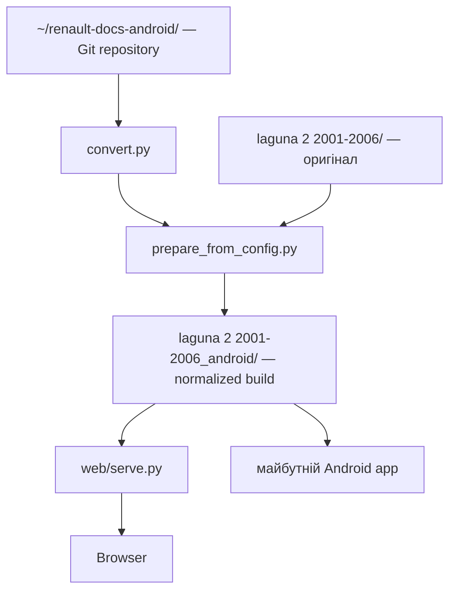

# Робота з репозиторієм і документацією на Android

## Поточна структура

Репозиторій:

```text
$HOME/renault-docs-android/
```

Оригінальна документація:

```text
/storage/emulated/0/Documents/Renault/laguna 2 2001-2006/
```

Результат конвертації:

```text
/storage/emulated/0/Documents/Renault/laguna 2 2001-2006_android/
```

У `config/current-device.json` ці три шляхи збережені як `repository_root`, `source_root` і `build_root`.

## Схема



## Підготовка Termux

Потрібні Git, Python та доступ Termux до спільної пам'яті:

```bash
pkg update
pkg install git python openssh
termux-setup-storage
```

Після `termux-setup-storage` Android покаже запит на доступ до файлів. Його потрібно дозволити.

## Клонування в private storage Termux

Папка призначення:

```text
/data/data/com.termux/files/home/renault-docs-android
```

Не перенось сюди Renault source/dataset/APK: вони залишаються під `/storage/emulated/0/Documents/Renault/`. Перед клонуванням `$HOME/renault-docs-android` повинна бути порожня або не існувати.

Якщо Git у Termux уже авторизований у GitHub і ти ним користуєшся для іншого репозиторію, повторно налаштовувати SSH/2FA не потрібно.

Команда клонування:

```bash
git clone --branch main --single-branch git@github.com:faric-ua/renault-docs-android.git "$HOME/renault-docs-android"
cd "$HOME/renault-docs-android"
```

Перевірка:

```bash
git status
git remote -v
```

## Коротка команда reno-code

Після клонування виконай один раз:

```bash
bash tools/install_termux_aliases.sh
source ~/.bashrc
```

Після цього з будь-якої папки:

```bash
reno-code
```

миттєво переведе в:

```text
$HOME/renault-docs-android
```

Фактично встановлюється:

```bash
alias reno-code='cd "$HOME/renault-docs-android"'
```

Якщо ти використовуєш Zsh, installer автоматично вибере `~/.zshrc`.

## Конвертація

Після `reno-code`:

```bash
python convert.py
```

Оригінал не змінюється. Створюється:

```text
/storage/emulated/0/Documents/Renault/laguna 2 2001-2006_android/
```

## Запуск браузерної версії

```bash
reno-code
python web/serve.py "/storage/emulated/0/Documents/Renault/laguna 2 2001-2006_android" --host 0.0.0.0 --port 8080
```

У браузері:

```text
http://127.0.0.1:8080/
```

## Чому Git не лежить у /storage/emulated/0

Android shared storage не гарантує звичайну Linux-семантику permissions/executable flags і створює зайві проблеми для Git/Gradle. Тому живий checkout тримаємо в `$HOME/renault-docs-android`, а shared storage використовуємо тільки для source documentation, converted datasets, logs та APK/packages.


## Швидкий запуск без довгої команди

Після оновлення репозиторію:

```bash
reno-code
git pull
bash tools/install_termux_aliases.sh
source ~/.bashrc
```

Далі достатньо:

```bash
reno-docs
```

Скрипт сам запустить локальний server у фоні (якщо він ще не працює) і відкриє документацію в Android-браузері.

Зупинка:

```bash
reno-stop
```

Перевірка:

```bash
reno-status
```

Окремо підтримується запуск одним натисканням через Termux:Widget. Інструкція: `docs/ua/QUICK_LAUNCH.md`.
