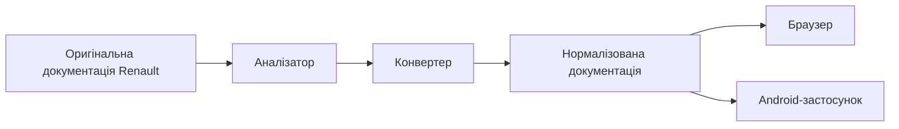
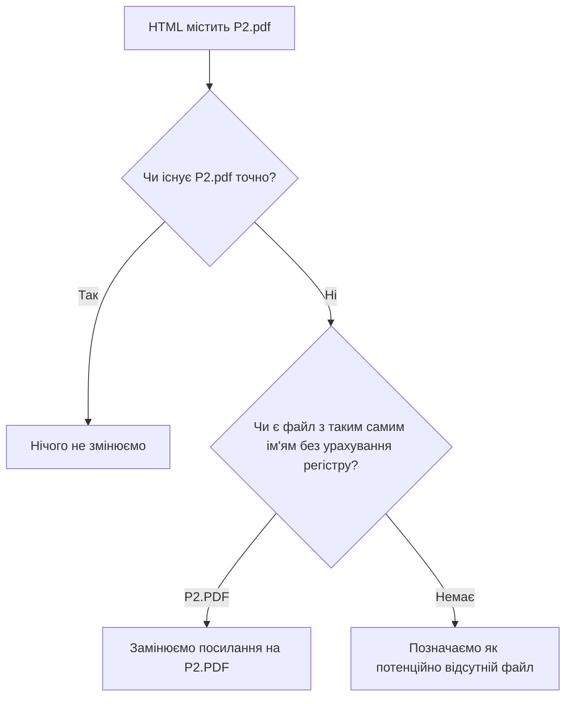
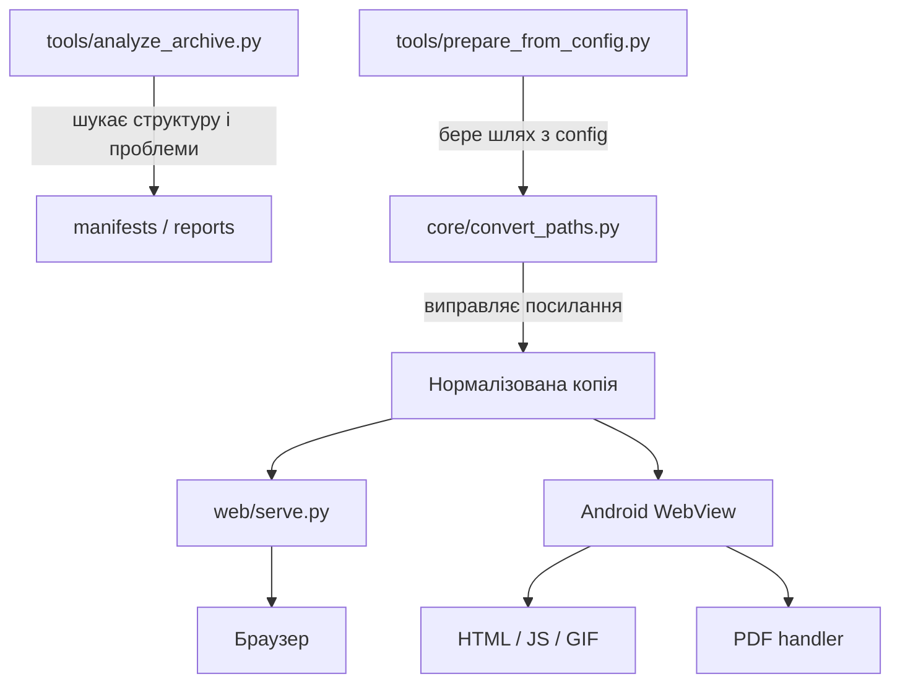
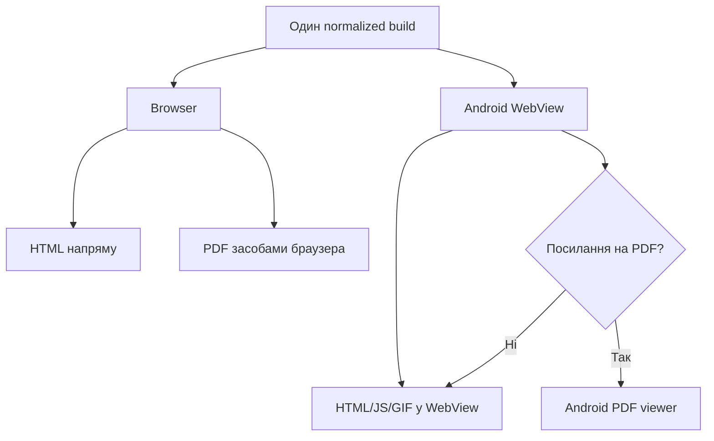
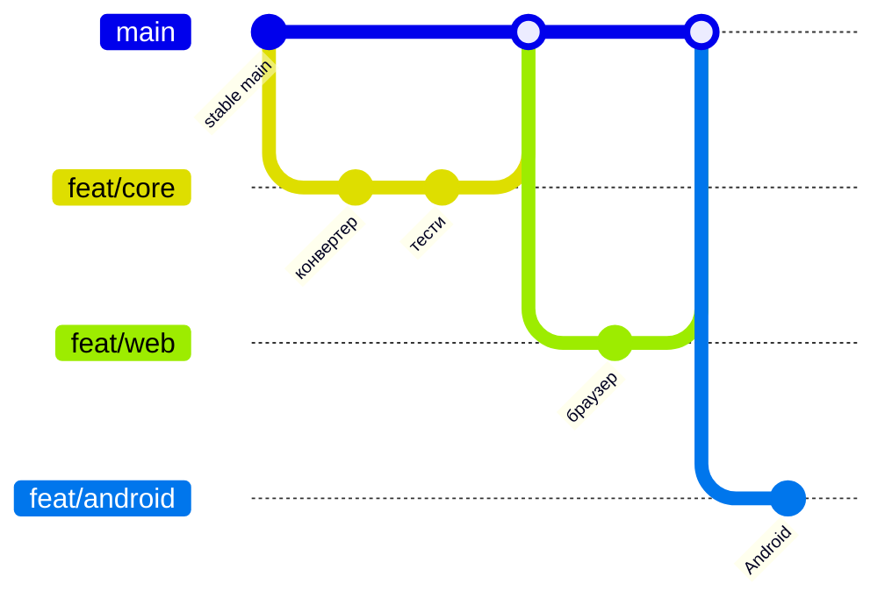

# Renault Docs Android — пояснення українською

Цей документ пояснює проєкт без прив'язки до деталей коду.

## 1. Що ми будуємо

Мета — зробити стару офлайн-документацію Renault придатною для:

- звичайного сучасного браузера;
- власного Android-застосунку.

При цьому **не створюються дві різні копії документації**. Спочатку формується одна виправлена версія, а вже потім її відкриває браузер або Android-застосунок.



## 2. Що було не так у Windows-документації

Windows зазвичай не розрізняє регістр у назвах файлів:

```text
P2.pdf
P2.PDF
```

Для Windows це часто один і той самий файл.

Android/Linux розрізняє:

```text
P2.pdf != P2.PDF
```

Тому стара документація могла нормально працювати на Windows, але втрачати PDF, GIF або HTM-переходи на Android.

Конвертер знаходить реальний файл і переписує посилання так, щоб регістр збігався точно.



## 3. Чому оригінал не змінюємо

Оригінальна папка є еталоном.

Конвертер працює так:

```text
Оригінал
/storage/emulated/0/Documents/Renault/laguna 2 2001-2006/

        ↓ копіювання + виправлення

Робоча Android/Linux-сумісна копія
/storage/emulated/0/Documents/Renault/laguna 2 2001-2006_android/
```

Це означає: якщо ми помилилися в алгоритмі, оригінальна документація залишається недоторканою і результат можна перебудувати з нуля.

## 4. Поточний шлях на телефоні

Поточна тестова папка документації:

```text
/storage/emulated/0/Documents/Renault/laguna 2 2001-2006/
```

У репозиторії цей шлях збережено в:

```text
config/current-device.json
```

Очікувана папка результату:

```text
/storage/emulated/0/Documents/Renault/laguna 2 2001-2006_android/
```

Це **конфігурація поточного пристрою**, а не жорстко зашитий шлях у самому конвертері. Пізніше Android-застосунок дозволить вибирати папку через інтерфейс.

## 5. Як працюють частини проєкту



### `tools/analyze_archive.py`

Нічого не виправляє. Його задача — дослідження:

- скільки файлів;
- які типи файлів;
- куди ведуть посилання;
- де є конфлікти регістру;
- які старі browser/API конструкції використовуються.

### `core/convert_paths.py`

Це головний конвертер.

Він:

1. читає структуру документації;
2. знаходить неправильний регістр у локальних посиланнях;
3. підставляє реальне ім'я файлу;
4. зберігає `#viewrect` та інші fragment/query частини;
5. виправляє підтверджені динамічні випадки у `VISU.JS`;
6. записує звіт про всі зміни.

### `tools/prepare_from_config.py`

Це зручний запуск для поточного телефона.

Він читає:

```text
config/current-device.json
```

і автоматично передає правильні source/output шляхи конвертеру.

### `web/serve.py`

Запускає простий локальний HTTP-сервер для вже виправленої документації.

Це потрібно тому, що запуск через:

```text
file:///storage/emulated/0/...
```

може поводитися інакше, ніж нормальний web-origin.

## 6. Браузер і Android — де вони розходяться



Спільний контент залишається один. Android додає лише те, чого браузер робить інакше: вибір файлів, локальне сховище, PDF viewer, back navigation тощо.

## 7. Як працюємо з Git



`main` завжди тримаємо у стабільному стані.

Для окремої задачі створюється `feat/...`, потім тести, Pull Request і злиття в `main`.

## 8. Що буде далі

Найближчий порядок:

1. Запустити normalized build з реальної папки телефона.
2. Відкрити його через локальний HTTP server.
3. Визначити правильний стартовий HTM-файл для кожної версії документації.
4. Перевірити меню, frames, JavaScript, схеми та PDF.
5. Зафіксувати browser-specific проблеми.
6. Після стабільного браузерного режиму створити Android WebView shell.
