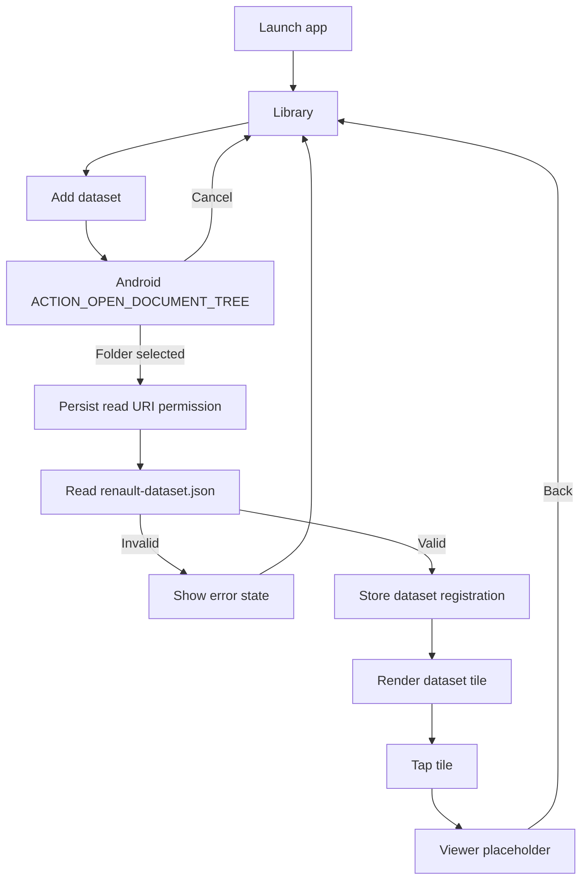

# Android Library Flow — v0.1.0



## Rotation contract

```text
Library / Viewer
      ↓ rotate
Activity recreation
      ↓
same semantic screen
      ↓
NO automatic SAF launch
NO duplicate registration
```
