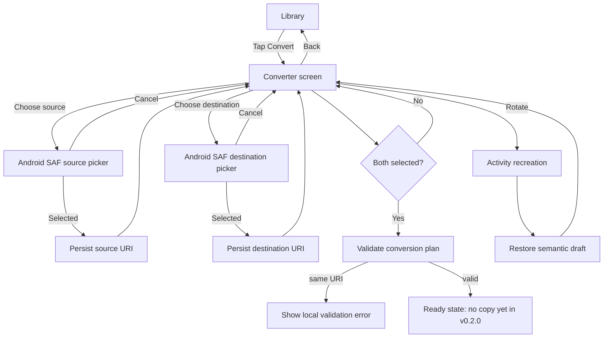

# v0.2.0 Flow / Test Diagram



Critical lifecycle invariant:

```text
selected source/destination
        ↓ rotation
Activity recreation
        ↓
same draft restored
        ↓
NO automatic picker launch
        ↓
NO conversion start
```
