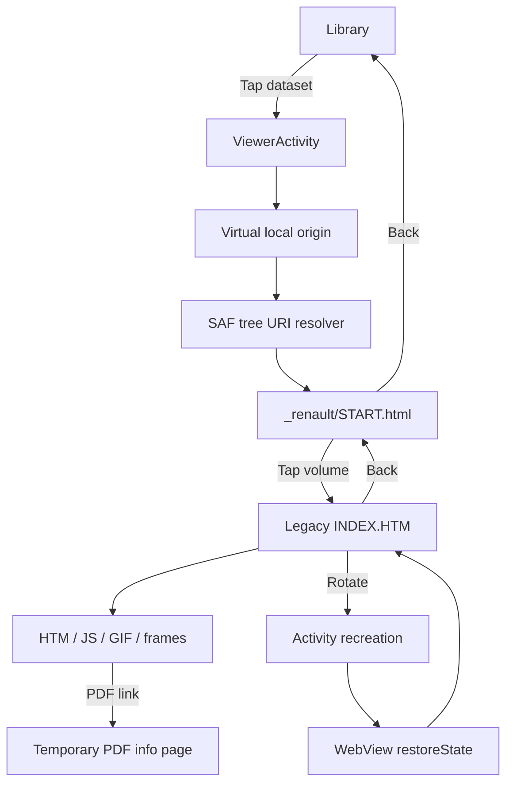

# v0.2.1 Viewer flow

```mermaid
flowchart TD
    A[Library] -->|Tap dataset| B[ViewerActivity]
    B --> C[Virtual local origin]
    C --> D[SAF tree URI resolver]
    D --> E[_renault/START.html]
    E -->|Tap volume| F[Legacy INDEX.HTM]
    F --> G[HTM / JS / GIF / frames]
    G -->|PDF link| H[Temporary PDF info page]

    F -->|Back| E
    E -->|Back| A

    F -->|Rotate| I[Activity recreation]
    I --> J[WebView restoreState]
    J --> F
```
