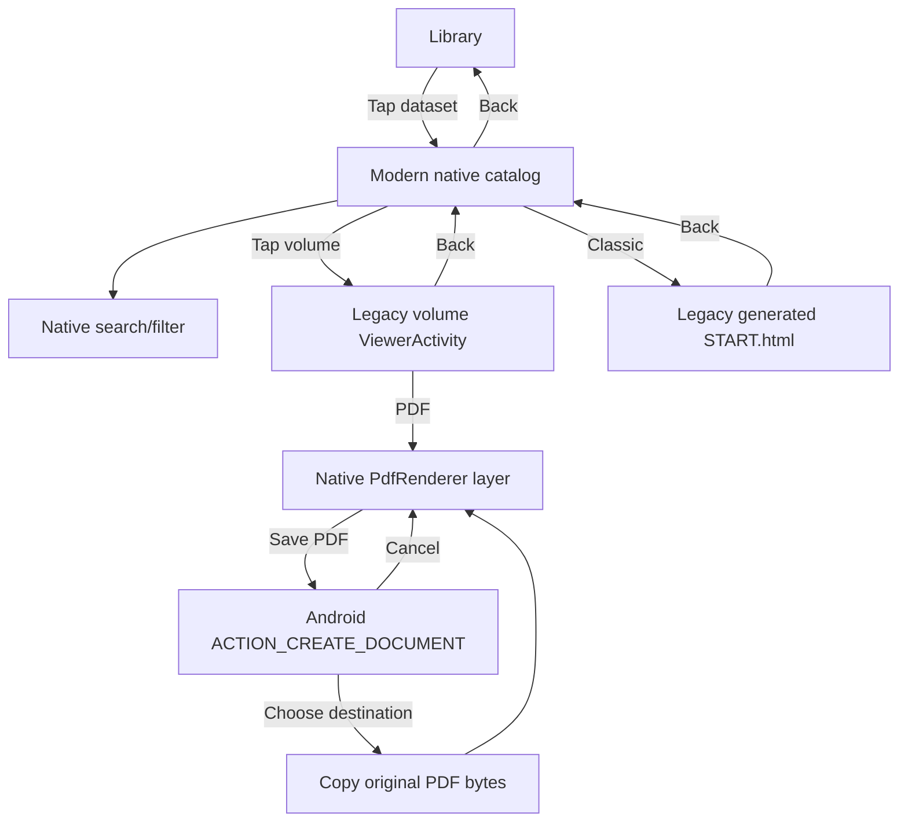

# v0.3.0 Modern / Classic / PDF export flow

```mermaid
flowchart TD
    A[Library] -->|Tap dataset| B[Modern native catalog]
    B --> C[Native search/filter]
    B -->|Tap volume| D[Legacy volume ViewerActivity]
    B -->|Classic| E[Legacy generated START.html]
    D -->|PDF| F[Native PdfRenderer layer]
    F -->|Save PDF| G[Android ACTION_CREATE_DOCUMENT]
    G -->|Cancel| F
    G -->|Choose destination| H[Copy original PDF bytes]
    H --> F

    B -->|Back| A
    D -->|Back| B
    E -->|Back| B
```
