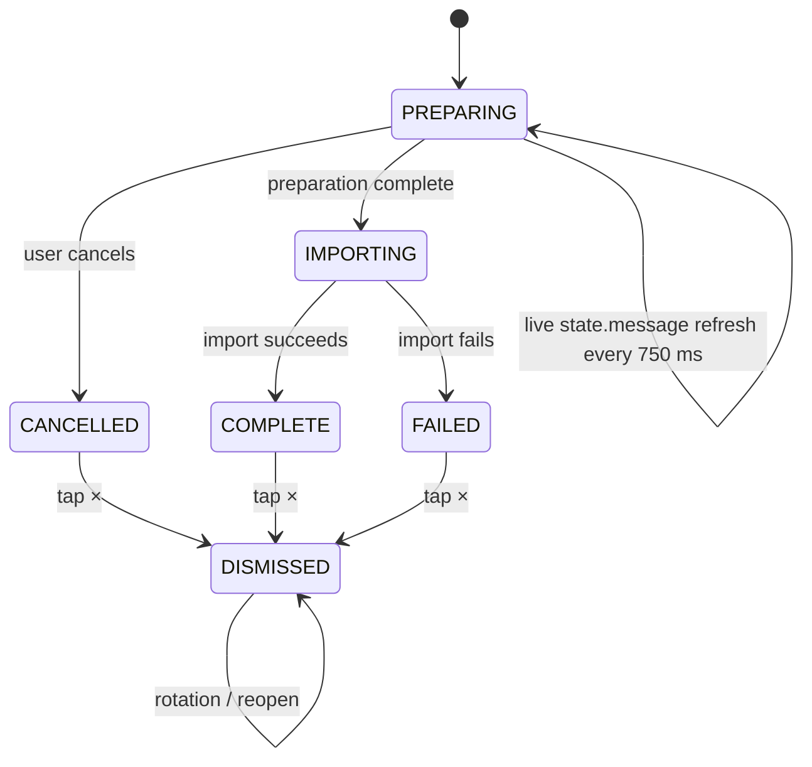

# v0.5.52 dialog/status lifecycle

Contract:
- active PREPARING / IMPORTING: no terminal dismiss `×`;
- if the active progress dialog is open, its message follows persisted run state;
- terminal states use the separate dismissible status row;
- dismissal hides presentation only and is scoped to the exact finished run.
