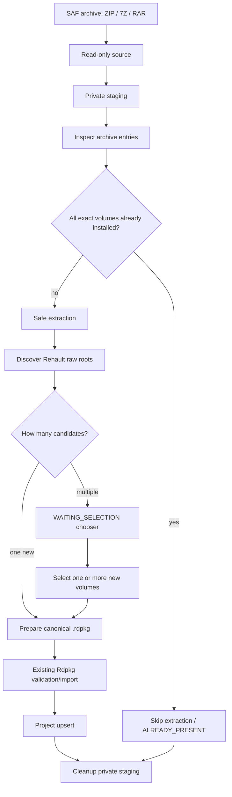
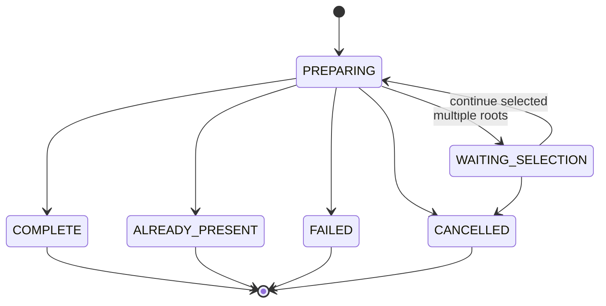

# v0.5.69 Archive Intake flow

Hard boundaries:
- source archive is never mutated;
- extraction writes only to app-private staging;
- output writes only to the explicit destination;
- Force Stop / device reboot remain hard lifecycle boundaries.
