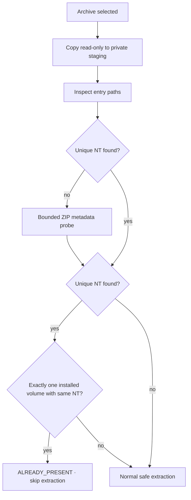

# v0.5.70 archive duplicate fast-path

```mermaid
flowchart TD
  A[Archive selected] --> B[Copy read-only to private staging]
  B --> C[Inspect entry paths]
  C --> D{Unique NT found?}
  D -- no --> E[Bounded ZIP metadata probe]
  E --> F{Unique NT found?}
  D -- yes --> F
  F -- yes --> G{Exactly one installed volume with same NT?}
  G -- yes --> H[ALREADY_PRESENT · skip extraction]
  G -- no --> I[Normal safe extraction]
  F -- no --> I
```
