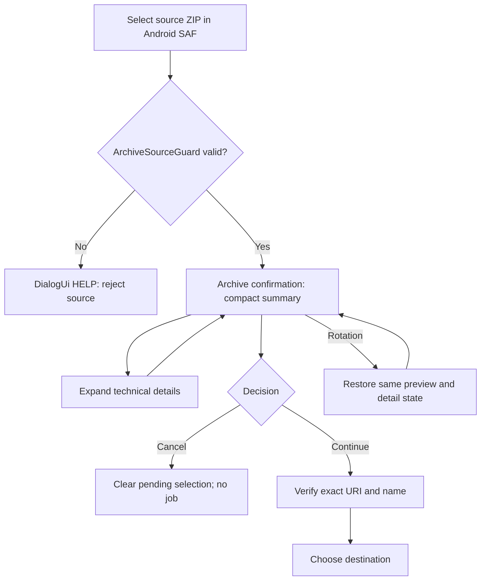

# v0.5.81 Dialog flow and test diagram

Global styling wrapper:
`AlertDialog.Builder(...).create() → show() → DialogUi.apply(dialog, DialogRole.X)`.
This existing pattern is shared by 20 audited app-owned AlertDialogs. The source/decision state lives with each screen; styling never executes actions.
