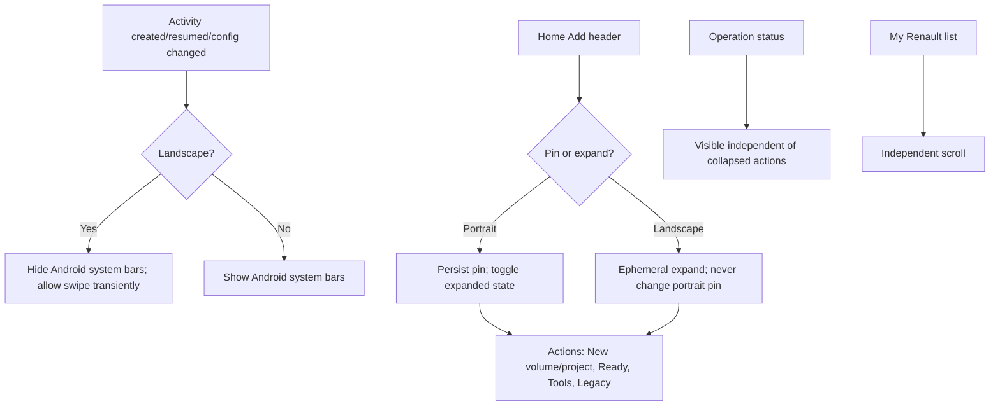

# Home Add + global bars flow

```mermaid
flowchart TD
  A[Activity created/resumed/config changed] --> B{Landscape?}
  B -- Yes --> C[Hide Android system bars; allow swipe transiently]
  B -- No --> D[Show Android system bars]
  E[Home Add header] --> F{Pin or expand?}
  F -- Portrait --> G[Persist pin; toggle expanded state]
  F -- Landscape --> H[Ephemeral expand; never change portrait pin]
  G --> I[Actions: New volume/project, Ready, Tools, Legacy]
  H --> I
  J[Operation status] --> K[Visible independent of collapsed actions]
  L[My Renault list] --> M[Independent scroll]
```
