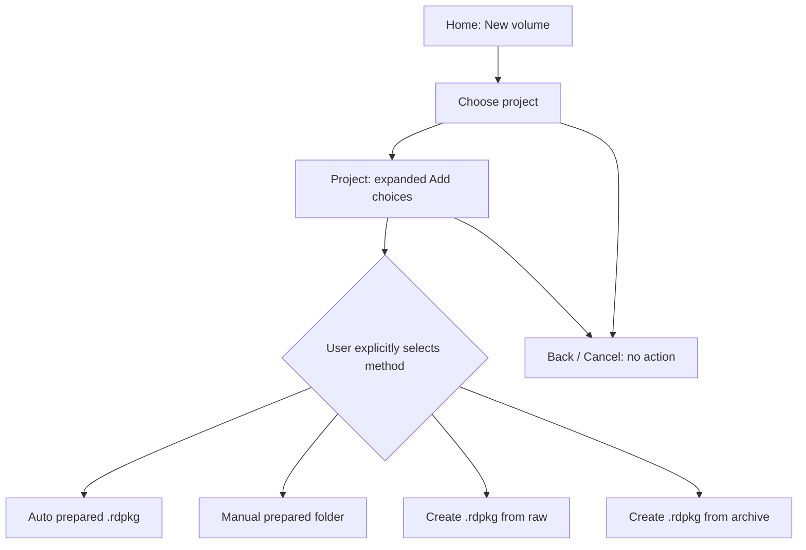

# Home New Volume handoff

```mermaid
flowchart TD
  A[Home: New volume] --> B[Choose project]
  B --> C[Project: expanded Add choices]
  C --> D{User explicitly selects method}
  D --> E[Auto prepared .rdpkg]
  D --> F[Manual prepared folder]
  D --> G[Create .rdpkg from raw]
  D --> H[Create .rdpkg from archive]
  B --> I[Back / Cancel: no action]
  C --> I
```

Initial route selection never launches Android SAF or starts a background operation. The old explicit `openPicker` option remains supported for intentional callers.
