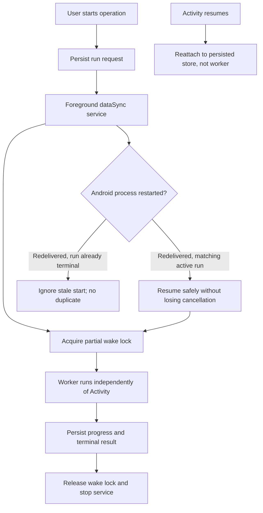

# Background lifecycle / safe redelivery

```mermaid
flowchart TD
  A[User starts operation] --> B[Persist run request]
  B --> C[Foreground dataSync service]
  C --> D[Acquire partial wake lock]
  D --> E[Worker runs independently of Activity]
  E --> F[Persist progress and terminal result]
  F --> G[Release wake lock and stop service]
  C --> H{Android process restarted?}
  H -->|Redelivered, matching active run| I[Resume safely without losing cancellation]
  H -->|Redelivered, run already terminal| J[Ignore stale start; no duplicate]
  I --> D
  K[Activity resumes] --> L[Reattach to persisted store, not worker]
```

Cancel intent must remain durable through replay; reboot and user force-stop are outside automatic recovery contract.
