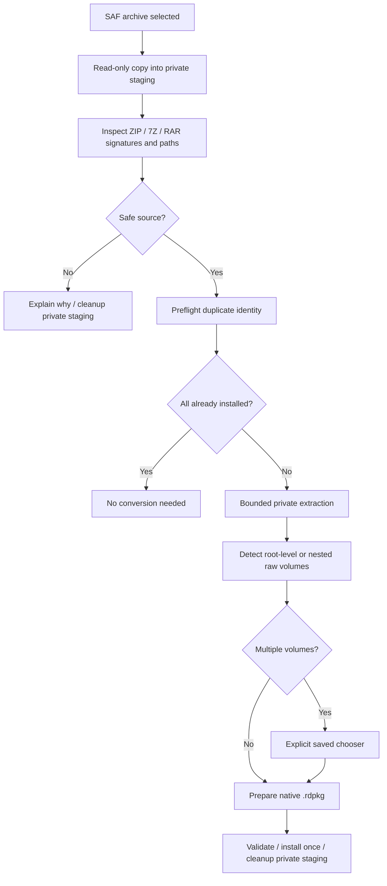

# Archive intake data flow

```mermaid
flowchart TD
  A[SAF archive selected] --> B[Read-only copy into private staging]
  B --> C[Inspect ZIP / 7Z / RAR signatures and paths]
  C --> D{Safe source?}
  D -->|No| E[Explain why / cleanup private staging]
  D -->|Yes| F[Preflight duplicate identity]
  F --> G{All already installed?}
  G -->|Yes| H[No conversion needed]
  G -->|No| I[Bounded private extraction]
  I --> J[Detect root-level or nested raw volumes]
  J --> K{Multiple volumes?}
  K -->|Yes| L[Explicit saved chooser]
  K -->|No| M[Prepare native .rdpkg]
  L --> M
  M --> N[Validate / install once / cleanup private staging]
```
