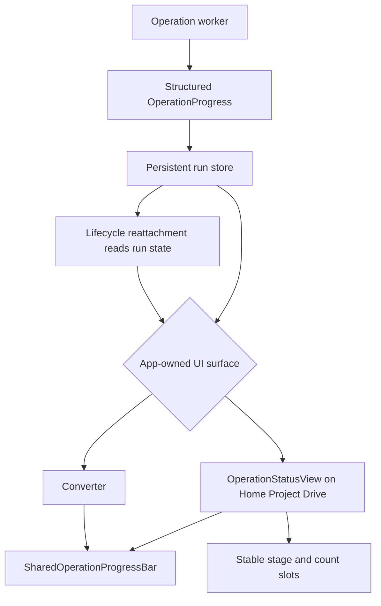

# Shared progress presentation flow

Status rendering never owns or restarts a worker. File counters must be sourced from measured progress, and operation completion remains separate from the live view.
