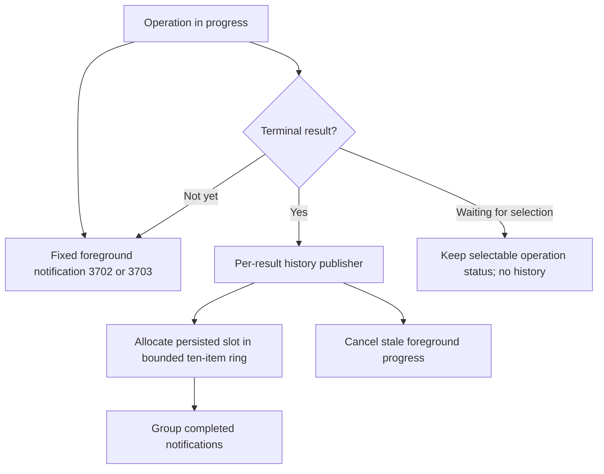

# Android notification lifecycle — v0.5.89

```mermaid
flowchart TD
  A[Operation in progress] --> B[Fixed foreground notification 3702 or 3703]
  A --> C{Terminal result?}
  C -->|Not yet| B
  C -->|Yes| D[Per-result history publisher]
  D --> E[Allocate persisted slot in bounded ten-item ring]
  E --> F[Group completed notifications]
  D --> G[Cancel stale foreground progress]
  C -->|Waiting for selection| H[Keep selectable operation status; no history]
```

The notification summary and all completed results are separate from the foreground ID. Display history never changes package or installed volume data.
