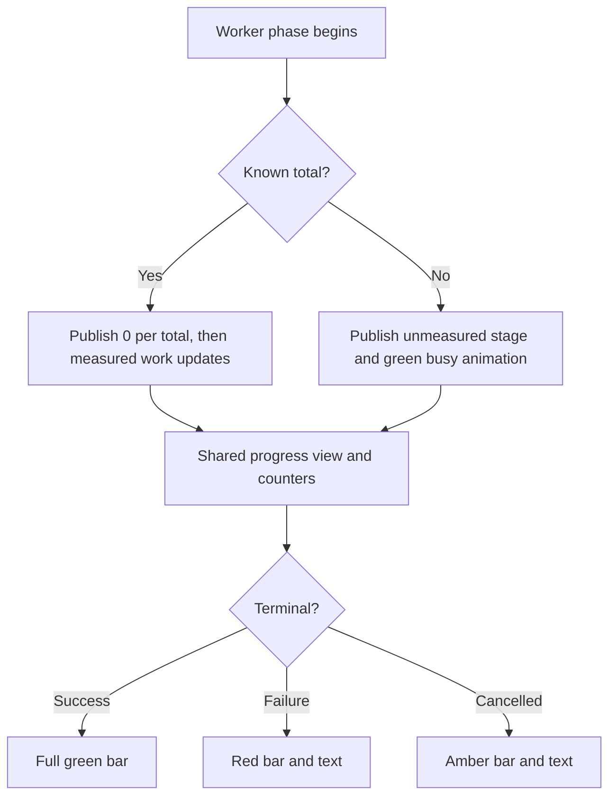

# Measured phase contract

```mermaid
flowchart TD
  A[Worker phase begins] --> B{Known total?}
  B -->|Yes| C[Publish 0 per total, then measured work updates]
  B -->|No| D[Publish unmeasured stage and green busy animation]
  C --> E[Shared progress view and counters]
  D --> E
  E --> F{Terminal?}
  F -->|Success| G[Full green bar]
  F -->|Failure| H[Red bar and text]
  F -->|Cancelled| I[Amber bar and text]
```
